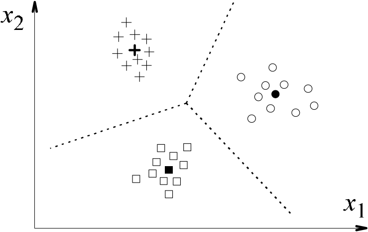
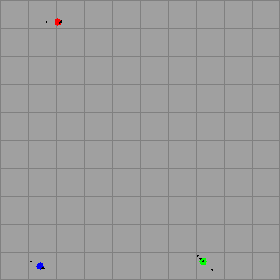

An etalon is a point that well represents a class of an object. We will compute etalons for each class of objects in our training image.
Then we will classify unknown objects by finding the closest etalon. The unknown object is then assigne the class label of the closes etalon.
An illustration of such a situation is depicted in Figure !ref(fig:etalons_diagram).

{ width=60% }

## Computing Etalons

Etalon $\mathbf{e}_r$ is a vector that best represents each class $\omega_r$.
The easiest way to compute the etalon is by computing the average value
\begin{equation}
    \mathbf{e}_r = \frac{1}{N_r}\sum\limits_{i=1}^{N_r} \mathbf{x}_{r, i} \, ,
    \label{eq:average}
\end{equation}
where $N_r$ is number of training feature points of the class $\omega_r$ and $\mathbf{x}_{r, i}$ are values of the feature point vector.

In our case the  $\omega_r$ consists of square, rectangle, and star. Values $\mathbf{x}_{r, i}$ are from vectors $F_1$ and $F_2$.

Let's assume that an unknown object (one that we obtain from our testing image) is represented using feature vector $\mathbf{x}$.
Our classifier that assigns the unknown object a class of which etalon has the shortest distance to the point $\mathbf{x}$

\begin{equation}
    \min\limits_{r} \big( \text{dist} \left( \mathbf{e}_r, \mathbf{x} \right) \big) \, .
\end{equation}

{ width=60% }

